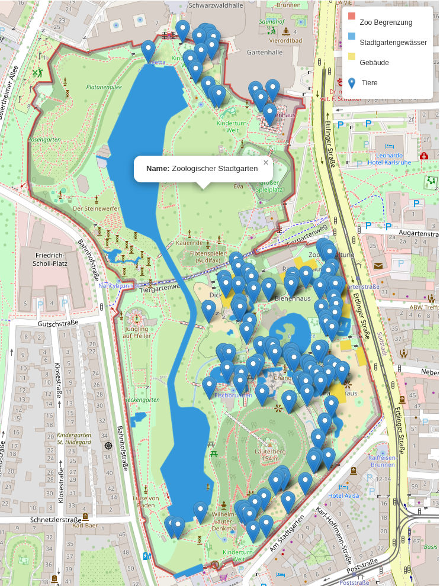
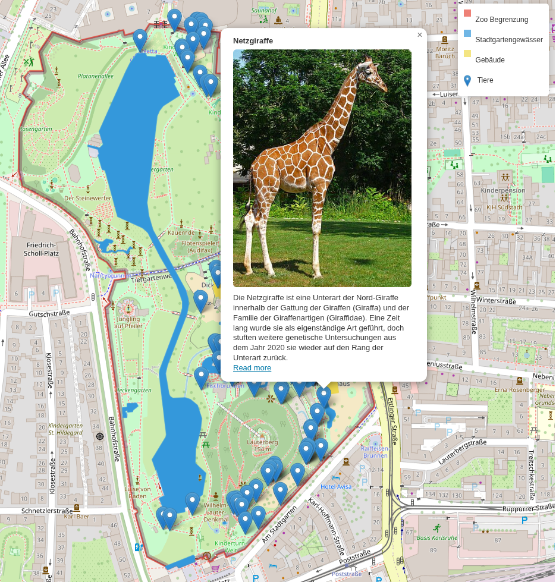

# Karlsruhe Zoo Map is part of the prerequisite for the course Geoinformatics B. The exercise involved creating a map of the "Karlsruhe Zoo" with specific geographical and informational elements.

## Project Description

The aim of this project is to display an interactive map of the Karlsruhe Zoo that includes:

- **Zoo Boundary**
- **Water Bodies**
- **Interesting Animals**
- **Tourist Information Boards**

### Data Acquisition

The data for this project was acquired using the Overpass Turbo web interface with the following queries:

- **Buildings in Karlsruhe Zoo:**
  ```xml
  [out:json][timeout:25];
  area["name:en"="Karlsruhe Zoo"]->.searchArea;
  (
    way[building=zoo](area.searchArea);
  );
  out body;
  >;
  out skel qt;
  ```

- **Water Bodies in Karlsruhe Zoo:**
  ```xml
  [out:json][timeout:25];
  area["name:en"="Karlsruhe Zoo"]->.searchArea;
  (
    wr[natural=water](area.searchArea);
  );
  out body;
  >;
  out skel qt;
  ```

- **Zoo Boundaries:**
  ```xml
  [out:json][timeout:25];
  area[name=Karlsruhe]->.searchArea;
  (
    way["name:en"="Karlsruhe Zoo"](area.searchArea);
  );
  out body;
  >;
  out skel qt;
  ```

- **Tourist Information Boards (Wildlife):**
  ```xml
  [out:json][timeout:25];
  area["name:en"="Karlsruhe Zoo"]->.searchArea;
  (
    node[tourism=information][board_type=wildlife](area.searchArea);
  );
  out body;
  >;
  out skel qt;
  ```

### Interactive Features

An interactive map was created where users can click on markers to access information about animals. The animal data is retrieved via the open Wikipedia search API. While most markers provide accurate information, some nodes may not return precise results. However, the majority of the markers accurately depict information about the animals in the zoo.

### Screenshots

Here are some example screenshots of the static site:





## Running the Project

To run this project, follow these steps:

1. Ensure you have `npx` installed on your machine.
2. Clone this repository to your local machine.
3. Open a terminal and navigate to the root directory named `Geoinf_Ex_SS25_prereq`.
4. Run the live server using the following command:

   ```bash
   npx live-server .
   ```

This will start a local server and open your default browser to display the interactive map of Karlsruhe Zoo.

---

